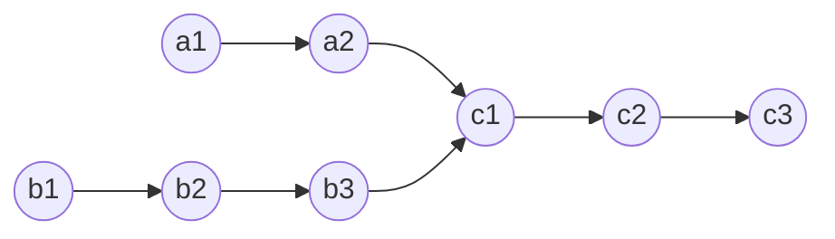

### 160.相交链表

`题目描述：`

给定两个单链表的头节点`headA`和`headB`，请找出并返回两个链表相交的起始节点，如果两个链表没有交点，返回`null`

图示两个链表在节点`c1`开始相交：



`约定`

- 数据中不会存在环


##### 解法1：

- ###### 思路：

  1. 若其中一个链表为`null`,则直接返回`null`
  2. 循环比较

- ###### 代码：

  ```javascript
  /**
   * Definition for singly-linked list.
   * function ListNode(val) {
   *     this.val = val;
   *     this.next = null;
   * }
   */
  
  /**
   * @param {ListNode} headA
   * @param {ListNode} headB
   * @return {ListNode}
   */
  var getIntersectionNode = function(headA, headB) {
      if(headA == null || headB == null) 
          return null
      let a = headA
      let b = headB
      while(a != b){
          a = a == null? headB: a.next
          b = b == null? headA: b.next
      }
      return a
  };
  
  1，2，3，4，5，5，4，2, null
  5，4，2，1，2，3，4，5, null
  
  
  ```


