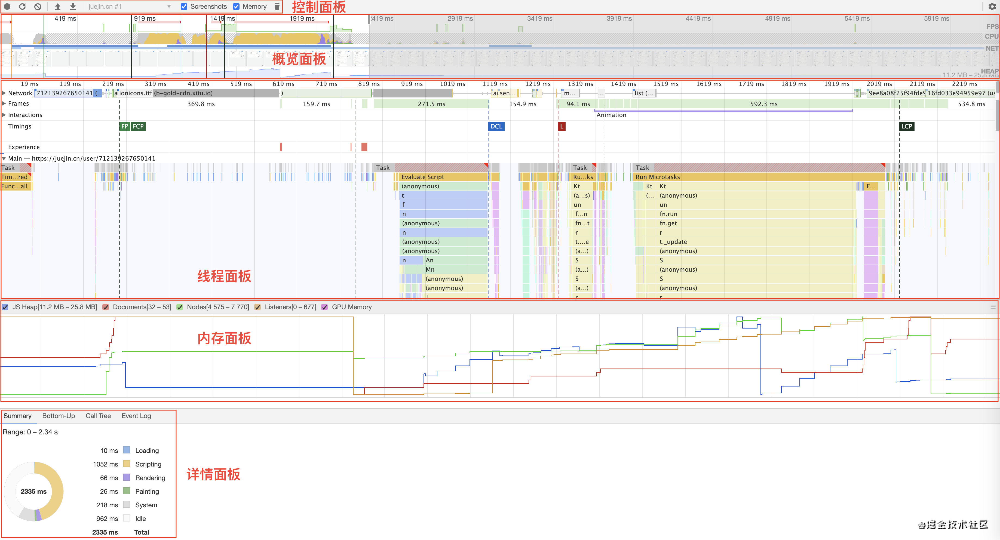

## 快速定位网站性能问题

#### 使用Chrome开发者工具的Performance性能面板

各个部分的介绍：

- ##### 控制面板

  - 手动录制
  - 自动录制
  - 清除记录

- ##### 概览面板

  - FPS
  - CPU
  - NET
  - HEAP

- ##### 线程面板

  

- ##### 内存面板

  - JS Heap
  - Document
  - Nodes
  - Listeners
  - GPU Memory

- ##### 详情面板

  